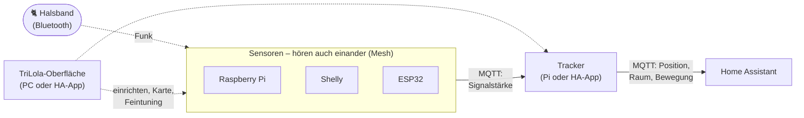

  

<b>Wo ist Lola?</b> – Indoor-Ortung für eine Katze mit Bluetooth-Halsband, 
Sensoren in der Wohnung und Home Assistant.

  <a href="#installation">Installation</a> ·
  <a href="#in-home-assistant-einbinden">Home Assistant</a> ·
  <a href="docs/BEDIENUNG.md">Bedienung</a> ·
  <a href="docs/MODELL.md">Modell &amp; Parameter</a> ·
  <a href="docs/TECHNIK.md">Technik-Referenz</a>

---

## Was ist TriLola?

Lola trägt ein kleines **Bluetooth-Halsband** (BLE-Tag). In der Wohnung verteilte **Sensoren** –
Raspberry Pis, Shellys und ESP32 – hören dessen Signal und melden, wie stark sie es empfangen.
Ein zentraler **Tracker** rechnet daraus laufend aus, **wo Lola ist, in welchem Raum und ob sie
sich bewegt**, und meldet das an **Home Assistant**. Dort erscheint sie wie ein Familienmitglied:
auf der Karte, als Raum-Sensor, als „zu Hause / unterwegs“.

Das Besondere:

* **Ein Werkzeug für alles.** Die TriLola-Oberfläche richtet alle Geräte ein, aktualisiert sie
  und zeigt Lola live auf dem Grundriss – am PC per Doppelklick oder als App in Home Assistant.
* **Wände zählen mit.** Aus dem gezeichneten Grundriss weiß das Modell, wo Funk gedämpft wird
  und wo Lola nicht hindurchkommt.
* **Die Sensoren kontrollieren sich gegenseitig.** Sie hören auch einander (Mesh). Daraus erkennt
  der Tracker, wenn ein Sensor schlechter hört, und zeichnet eine Funkkarte der Wohnung.
* **Ehrliche Unsicherheit.** Ein Partikelfilter liefert nicht nur einen Punkt, sondern auch, wie
  sicher er ist – sichtbar als Genauigkeitskreis und „Aufenthaltswolke“.

Wie das Modell rechnet, steht in [Modell & Parameter](docs/MODELL.md).

---

## Was du brauchst

| | |
|---|---|
| **Halsband** | ein BLE-Tag, der regelmäßig sendet (seine MAC-Adresse trägst du einmal ein) |
| **Sensoren** | beliebig gemischt, **mindestens 3**, besser 5+ gut verteilt: Raspberry Pi (mit Bluetooth), Shelly Gen2+ mit Bluetooth (Plus, Pro, Gen3/Gen4), ESP32 (z. B. ESP32-DevKit) |
| **Home Assistant** | mit MQTT-Broker (App/Add-on **Mosquitto**) |
| **PC** | Windows, Linux oder macOS mit **Python 3.10+** – für die Einrichtung und für den ersten USB-Flash der ESP32 |

Alle Geräte müssen im selben Netz wie Home Assistant sein.

---

## Installation

Alles läuft über die **TriLola-Oberfläche**. Sie merkt sich alle Geräte und Zugangsdaten in
einer einzigen Datei, `deploy/fleet.toml`, und spielt die passende Software auf jedes Gerät.
Reihenfolge: Oberfläche starten → Einstellungen → Pis → Shellys → ESP32 → Tracker → fertig.

### 1. Oberfläche starten (`rollout.bat`)

1. Repository herunterladen (grüner Knopf *Code → Download ZIP* oder `git clone`) und entpacken.
2. **Doppelklick auf `rollout.bat`** (Linux/macOS: `./rollout.sh`).
   Beim ersten Start richtet sie eine eigene Python-Umgebung ein (etwa eine Minute) und öffnet
   dann die Oberfläche im Browser.
   * Fehlt Python: von [python.org](https://www.python.org) installieren und dabei
     **„Add python.exe to PATH“** anhaken.
3. Die Oberfläche läuft nur auf deinem PC (`127.0.0.1`) und ist mit einem Schlüssel im Link
   geschützt. Starte sie deshalb immer über `rollout.bat` – ein Lesezeichen enthält den Schlüssel nicht.

Was macht <code>rollout.bat</code> genau?

Es legt `deploy/.venv` an, installiert die Pakete aus `deploy/requirements-gui.txt` (nur beim
ersten Mal oder wenn sich die Liste ändert) und startet `deploy/bluecat_gui.py`. Beenden: Fenster
schließen. Alle Funktionen gibt es auch auf der Kommandozeile – siehe
[Technik-Referenz](docs/TECHNIK.md#kommandozeile-gleiche-funktionen).

### 2. Einstellungen

Reiter **Einstellungen** – einmal ausfüllen, alles Weitere baut darauf auf:

| Feld | Wozu |
|---|---|
| **MQTT-Broker** – Adresse, Port, Benutzer, Passwort | Hierüber reden alle Sensoren, der Tracker und Home Assistant. Mit *Verbindung testen* prüfen. |
| **WLAN** – Name und Passwort | wird in die ESP32-Firmware eingebaut |
| **ESP32-Updates** – OTA-Passwort | schützt Updates per WLAN; *Erzeugen* liefert ein sicheres |
| **Shellys** – Benutzer, Passwort, Netz für die Suche | Zugang zur Shelly-Weboberfläche (nur falls dort ein Passwort gesetzt ist) |
| **Tracker** – *Läuft auf*, *Halsband-MAC* | welcher Pi rechnet (siehe Schritt 6) und welches Halsband gesucht wird |

> Beim Umstieg von einer älteren Bluecat-Installation holt **⋯ → Alte Einstellungen übernehmen**
> an einem Pi MQTT-Zugang und Kartenursprung automatisch von dort.

### 3. Raspberry Pi (Unix)

Ein Pi kann **Sensor**, **Tracker** oder beides sein.

**Vorbereiten** (einmalig am Pi): aktuelles Raspberry Pi OS mit **SSH aktiviert**
(z. B. im Raspberry Pi Imager unter *Einstellungen → Dienste*), Bluetooth eingeschaltet, im
Netz erreichbar. Benutzername und Passwort merken.

**In der Oberfläche** (Reiter **Geräte → Raspberry Pi hinzufügen**):

1. Name, IP-Adresse und SSH-Benutzer eintragen.
2. **⋯ → SSH-Zugang einrichten** – einmal das Pi-Passwort eingeben. Danach meldet sich die
   Oberfläche per Schlüssel an; das Passwort wird nicht gespeichert.
3. **Installieren** – fragt einmal das sudo-Passwort (bleibt nur im Speicher). Die Oberfläche
   * legt unter `~/bluecat` eine eigene Python-Umgebung an,
   * installiert den Sensor als Dienst `bluecat-sensor` (und ggf. den Tracker als `trilola`),
   * schaltet den erweiterten Bluetooth-Modus ein (BlueZ `-E`),
   * löst alte Bluecat-Dienste ab – **⋯ → Zur alten Installation zurück** macht das rückgängig.

Danach zeigt die Karte des Pis *online*, Version und ob er Lola gerade sieht.

### 4. Shellys

Geeignet sind Shellys der **2. Generation oder neuer mit Bluetooth** (Plus, Pro, Gen3/Gen4),
Firmware 2.0 oder neuer, Eco-Modus aus (erledigt die Oberfläche). Gen1-Geräte können keine Skripte ausführen.

1. Shelly wie gewohnt in dein WLAN bringen (Shelly-App oder Weboberfläche).
2. Reiter **Geräte → Shelly → Im Netz suchen**. Gefundene Geräte erscheinen unter
   **„Neue Geräte gefunden“** → **Als neues Gerät** (oder **Bestehendem Gerät zuordnen …**;
   **Ausblenden** für Shellys, die kein Sensor werden sollen).
3. **Einrichten**. Die Oberfläche
   * lädt das TriLola-Skript hoch und startet es,
   * schaltet **Bluetooth** ein, trägt den **MQTT-Broker** ein und schaltet den **Eco-Modus** aus,
   * startet den Shelly neu, wenn eine Einstellung das verlangt.

Die Bluetooth-Adresse leitet TriLola aus der WLAN-Adresse ab (WLAN-MAC + 2). Weicht sie bei einem
Gerät ab, trägst du sie beim Gerät unter *Bearbeiten* bzw. in `fleet.toml` (`ble_mac`) ein.

### 5. ESP32 – erst per USB, danach per WLAN

Alle ESP32 bekommen **dieselbe Firmware**. Welcher Sensor ein ESP32 ist, erfährt er nach dem
Start selbst per MQTT – deshalb gibt es nichts pro Gerät zu konfigurieren.

**Einmalig: Werkzeug installieren.** *Wartung → ESP32-Werkzeug → Installieren*
(PlatformIO, einige Minuten; beim ersten Bauen lädt es zusätzlich den ESP32-Compiler).
Später heißt der Knopf *Neu installieren / aktualisieren*.

**Erster Flash per USB** – für jeden neuen ESP32 genau einmal:

1. ESP32 per USB-Kabel an den PC stecken. Wird kein Port gefunden, fehlt meist der Treiber
   (**CP210x** oder **CH340**) oder das Kabel lädt nur.
2. Reiter **Geräte → ESP32 → Neuen ESP32 per USB** → Port wählen (die Oberfläche erkennt ESP32
   meist selbst) → **Flashen**.
   * Hängt es bei „Connecting…“: die **BOOT-Taste** am ESP32 gedrückt halten, bis es weiterläuft.
3. Der ESP32 startet, verbindet sich mit dem WLAN und erscheint unter **„Neue Geräte gefunden“**
   → **Als neues Gerät**. Seine Bluetooth-Adresse wird automatisch eingetragen. (Flashst du über
   ⋯ → *Per USB flashen* an einem schon angelegten ESP32, wird er direkt diesem zugeordnet.)

**Danach per WLAN (OTA).** Updates brauchen kein Kabel mehr: **Per WLAN aktualisieren** am
Gerät oder **Alle aktualisieren** oben rechts. Das Update ist mit dem OTA-Passwort geschützt.

* Unter Windows fragt die Firewall beim ersten Mal, ob Python Verbindungen annehmen darf –
  **erlauben** (privates Netz), denn der ESP32 holt sich die Firmware vom PC ab.
* „Keine Antwort vom ESP32“: ist er online und stimmt die IP? Im Zweifel kurz vom Strom nehmen.

### 6. Tracker festlegen

Unter **Einstellungen → Tracker → Läuft auf** wählst du, wer rechnet – in der Regel ein Pi, der
ohnehin läuft (ein Pi 3/4/5 reicht; auf einem Pi Zero die *Anzahl Partikel* auf etwa 800 senken).
Beim nächsten **Installieren/Aktualisieren** dieses Pis kommt der Tracker mit. Wechselst du später
den Ort, zieht er samt Konfiguration, gelernter Werte und Kalibrierung um – auf Wunsch auch in die
Home-Assistant-App (diese Auswahl gibt es in der Oberfläche der App).

Trage außerdem die **Halsband-MAC** ein (steht auf dem Tag oder in dessen App). Ohne sie
zeichnen die Sensoren nichts auf. Ändern lässt sie sich auch in Home Assistant unter
**TriLola Zielobjekt-MAC**.

### 7. Fertig – und später aktualisieren

* **Alle aktualisieren** (oben rechts) bringt Pis, Shellys und ESP32 auf den Stand des Repos.
* Reiter **Protokoll** zeigt jede Aktion live; Passwörter werden dort geschwärzt.
* Nächster Schritt: **Wohnung einrichten** – Kartenbezug, Grundriss, Geräte platzieren und
  kalibrieren. Das beschreibt die [Bedienungsanleitung](docs/BEDIENUNG.md).

---

## In Home Assistant einbinden

### Automatisch per MQTT

Sobald der Tracker läuft, legt er in Home Assistant über **MQTT-Discovery** alles selbst an –
nichts zu konfigurieren außer der MQTT-Integration:

| Entität | Inhalt |
|---|---|
| **Lola** (`device_tracker`) | Position für die HA-Karte (die Zone, meist „Zuhause“, ergibt sich aus den Koordinaten); `not_home`, wenn außer Reichweite |
| **Lola Raum** | aktueller Raum aus dem Grundriss; „unbekannt“ außerhalb aller Räume, „außer Reichweite“, wenn sie weg ist |
| **Lola in Bewegung** | an/aus |
| **Lola GPS Position** | Koordinaten plus Diagnose (welcher Sensor was misst) |
| **TriLola Modell** | Auswahl `pf` (Standard) oder `legacy` |
| **TriLola Zielobjekt-MAC**, **Mesh-Baseline neu lernen** | Halsband wechseln; Mesh nach Umbauten neu lernen |
| je Sensor | BLE-MAC, Position X/Y, Höhe über Boden, Kalibrierwerte, Schalter „aktiv“ |

Damit die Karte in HA stimmt, braucht TriLola den **Kartenbezug** (wo das Haus auf der Welt liegt) –
siehe [Bedienung → Kartenbezug](docs/BEDIENUNG.md#1-kartenbezug).
Alte, verwaiste Einträge räumt **Wartung → Home Assistant aufräumen** auf (mit Vorschau).

### TriLola als App in Home Assistant

Die Oberfläche kann dauerhaft **in Home Assistant OS** laufen: in der Seitenleiste, mit der
HA-Anmeldung, die Daten in den HA-Backups. Die Rechenarbeit bleibt trotzdem auf dem Tracker-Pi –
die App braucht im Leerlauf fast nichts.

1. In Home Assistant die App **„Terminal & SSH“** installieren, ein Passwort (oder einen Schlüssel)
   eintragen und starten.
2. Am PC in `rollout.bat`: **Wartung → Als App auf Home Assistant → App installieren / aktualisieren** –
   IP von Home Assistant, SSH-Port, Benutzer und Passwort eintragen und beim ersten Mal
   **„Daten übernehmen“** anhaken. Das kopiert Geräte, Zugangsdaten, Grundriss-Bild und einen
   eigenen SSH-Schlüssel für die Pis in die App; Home Assistant baut sie dann (5–15 Minuten).
3. In Home Assistant: *Einstellungen → Apps → TriLola* → **„In der Seitenleiste anzeigen“**
   (und am besten **Watchdog** einschalten).

**Aktualisieren:** Repo am PC auf den neuesten Stand bringen, dann wieder
*App installieren / aktualisieren* – diesmal **ohne** „Daten übernehmen“. Klappt der Weg über
SSH nicht, siehe [Technik-Referenz → App](docs/TECHNIK.md#0a-als-app-in-home-assistant-früher-add-on).

Wo liegen die Daten der App?

In `addon_configs/local_trilola/` (per Samba/SSH sichtbar, Teil der Backups): `fleet.toml` mit
allen Geräten und Zugangsdaten, `plan/` mit Grundriss-Bild und Kalibrierplan, `ssh/` mit dem
Schlüssel der App für die Pis, `tracker/` nur, wenn der Tracker in der App läuft.

---

## Weiterlesen

| | |
|---|---|
| 📖 [**Bedienung**](docs/BEDIENUNG.md) | Wohnung einrichten, Geräte platzieren, kalibrieren, Livemodus, alle Optionen und das Feintuning |
| 📐 [**Modell & Parameter**](docs/MODELL.md) | die Mathematik hinter der Ortung und was jeder Parameter bewirkt |
| 🔧 [**Technik-Referenz**](docs/TECHNIK.md) | Architektur, MQTT-Topics, Dateiformate, Kommandozeile, Entwicklung und Tests |

## Datenschutz

Zugangsdaten, Grundriss, Positionen und MAC-Adressen bleiben lokal: `deploy/fleet.toml`,
`bt_tracker/config/`, `deploy/plan/` und die gebaute ESP32-Firmware stehen in `.gitignore`.
Die Oberfläche ist nur vom eigenen PC bzw. über die Home-Assistant-Anmeldung erreichbar,
sudo-Passwörter bleiben nur im Speicher, Protokolle schwärzen Passwörter.
Details: [Technik-Referenz → Was nicht ins Git gehört](docs/TECHNIK.md#9-was-nicht-ins-git-gehört).
